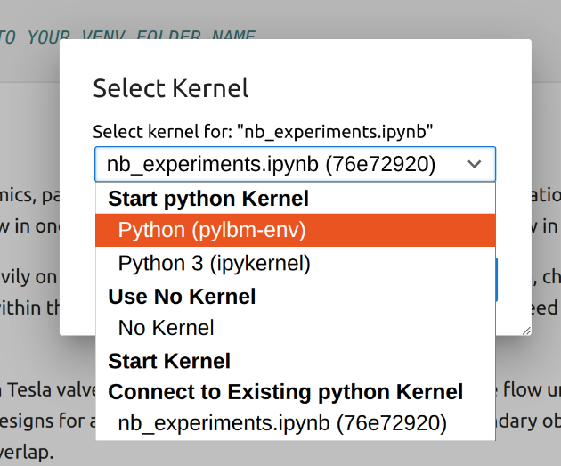

# Fluid Dynamics — Optimal Tesla Valve Design

This project uses **PyLBM (Lattice Boltzmann Method)** to simulate fluid flow and analyze Tesla valve designs.

There are **two Jupyter notebooks**, depending on what you want to do:

---

## Notebooks overview

### `experiments.ipynb` — run simulations
Requires the full scientific stack (PyLBM, Python 3.10, etc.).

You **must**:
- Create a virtual environment named **`pylbm-env`**
- Install all dependencies from `requirements.txt`
- Select the correct kernel in Jupyter

### `results.ipynb` — plot existing data
Only reads CSV files and generates plots.

**Requirements**:
- `pandas`
- `numpy`
- `matplotlib`

(No additional setup required.)

---

## Full setup (for experiments)

Run the following **from the project root** (`project_comp_sci`):

```bash
# System dependency (Ubuntu/Debian)
sudo apt update
sudo apt install -y python3.10 python3.10-venv

# Create and activate virtual environment
python3.10 -m venv pylbm-env
source pylbm-env/bin/activate

# Upgrade tooling
pip install --upgrade pip setuptools wheel

# Install all dependencies
pip install -r requirements.txt

# Then when all is ready you can view the jupyter notebooks
jupyter notebook
```

---

## Jupyter kernel selection (important)

When opening `experiments.ipynb`, make sure Jupyter is using the **`pylbm-env`** kernel.



---
